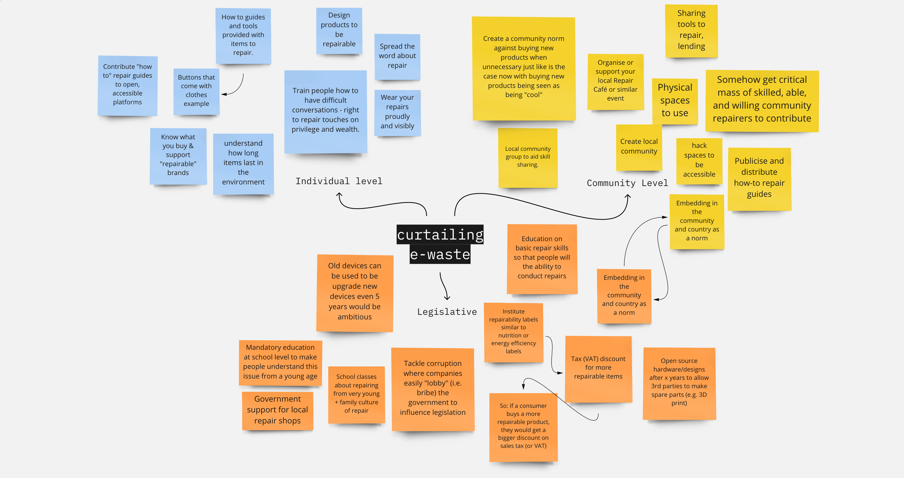
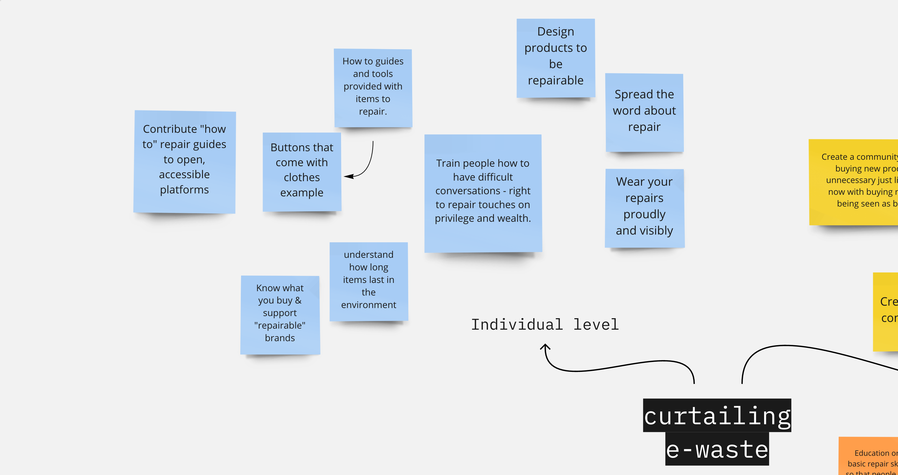
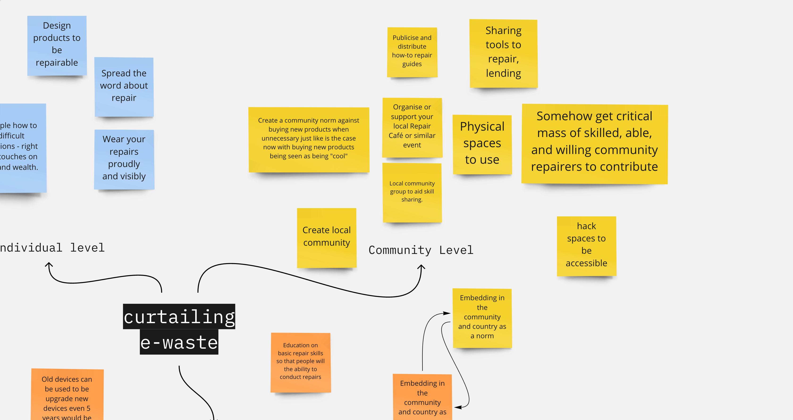
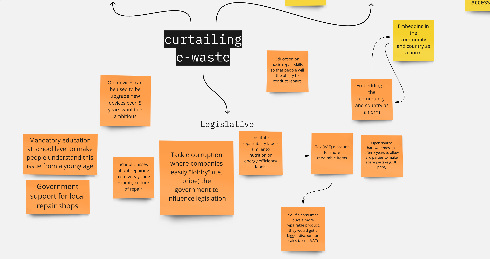

# Presentation
[Presentation slides](presentation.pdf)
# Session brainstorming

Close ups of the board:

# Resources
[Louis Rossmann showing how to repair things](https://www.youtube.com/user/rossmanngroup/videos)
## Starting your own repair-cafe
- https://www.repaircafe.org/en/start/
## Latest news on Right to Repair
- https://repair.eu/news/
- https://www.ifixit.com/News/category/right-to-repair
## Keywords for further research
circular economy, repair cafe, right to repair movement
